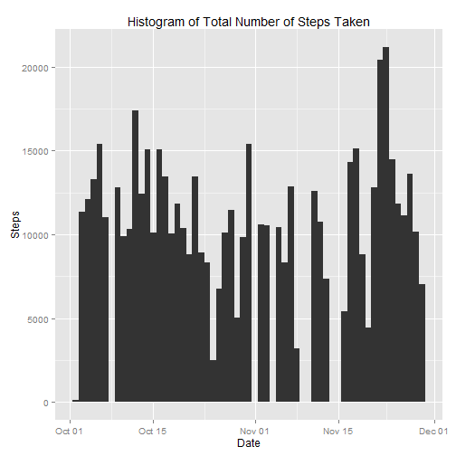
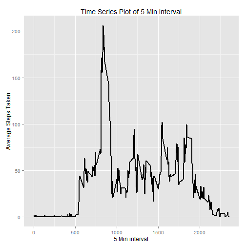
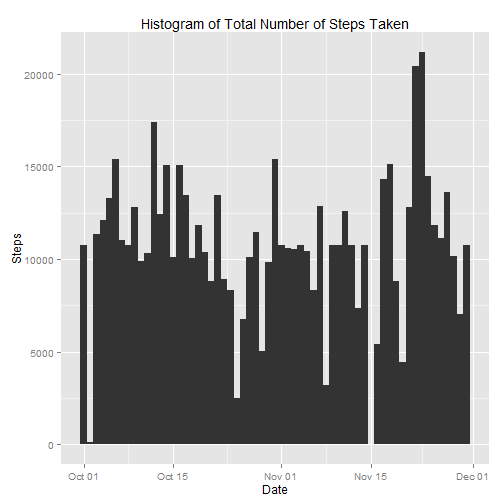
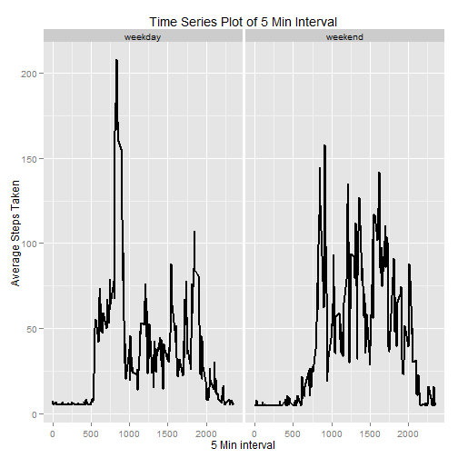

library(knitr)

##Loading and preprocessing the data
Read in the data and process, removing incomplete rows.


```r
myData <- read.csv("activity.csv", colClasses = c("integer", "Date", "factor"))
myData <- na.exclude(myData)
rownames(myData) <- 1:nrow(myData)
```

##What is mean total number of steps taken per day?
Construct a histogram of the average number of steps per day.

```r
library(ggplot2)
ggplot(myData, aes(date,steps)) +
  geom_bar(stat = "identity", width = 1.0) +
  labs(title = "Histogram of Total Number of Steps Taken",
       x = "Date", y = "Steps")
```

 

Calculate the mean and median total number of steps per day.

```r
totalSteps <- aggregate(myData$steps,list(myData$date),FUN="sum")[,2]
mean(totalSteps)
```

```
## [1] 10766.19
```

```r
median(totalSteps)
```

```
## [1] 10765
```

##What is the average daily activity pattern?
Make a time series plot of the 5-minute interval, averaged across all days.


```r
avgSteps <- aggregate(myData$steps,
                      list(as.numeric(as.character(myData$interval))),
                      FUN = "mean")
names(avgSteps) <- c("period","averageSteps")
ggplot(avgSteps, aes(period, averageSteps)) +
        geom_line(size = 1.0) +
        labs(title = "Time Series Plot of 5 Min Interval",
             x = "5 Min interval", y = "Average Steps Taken")
```

 

Which 5-minute interval, on average across all the days in the dataset, contains
the maximum number of steps?

```r
avgSteps[avgSteps$averageSteps == max(avgSteps$averageSteps),]
```

```
##     period averageSteps
## 104    835     206.1698
```

##Imputing missing values
Calculate and report the total number of missing values in the dataset.

```r
originalData <- read.csv("activity.csv",
                         colClasses = c("integer", "Date", "factor"))
sum(is.na(originalData))
```

```
## [1] 2304
```

Use the impute function from the Hmisc package to impute average number of steps
across all days.

```r
library(Hmisc)
```

```
## Warning: package 'Hmisc' was built under R version 3.1.2
```

```
## Loading required package: grid
## Loading required package: lattice
## Loading required package: survival
## Loading required package: splines
## Loading required package: Formula
```

```
## Warning: package 'Formula' was built under R version 3.1.2
```

```
## 
## Attaching package: 'Hmisc'
## 
## The following objects are masked from 'package:base':
## 
##     format.pval, round.POSIXt, trunc.POSIXt, units
```

```r
imputed <- originalData
imputed$steps <- with(imputed, impute(steps, mean))
```

Create the histogram for the imputed dataset.

```r
ggplot(imputed, aes(date,steps)) +
        geom_bar(stat = "identity", width = 1.0) +
        labs(title = "Histogram of Total Number of Steps Taken",
             x = "Date", y = "Steps")
```

```
## Don't know how to automatically pick scale for object of type impute. Defaulting to continuous
```

 

Look at the averages and medians of the original vs imputed datasets:

```r
totalSteps.imputed <- aggregate(imputed$steps,list(imputed$date),FUN="sum")[,2]
mean(totalSteps.imputed)
```

```
## [1] 10766.19
```

```r
mean(totalSteps)
```

```
## [1] 10766.19
```

```r
median(totalSteps.imputed)
```

```
## [1] 10766.19
```

```r
median(totalSteps)
```

```
## [1] 10765
```

##Are there differences in activity patterns between weekdays and weekends?
Create and call a function that uses the weekday() function to assign whether
the date is a weekday or weekend day.

```r
dayOfWeek <- function(date){
        if(weekdays(date) %in% c("Saturday","Sunday")){
                return("weekend")
        }
        else{
                return("weekday")
        }
}

day <- sapply(imputed$date, dayOfWeek)
imputed$day <- as.factor(day)
```

Calculate the average steps per interval, grouped by weekend vs weekday.

```r
avgSteps.imputed <- aggregate(imputed$steps,
                              list(as.numeric(as.character(imputed$interval)),
                                   imputed$day),
                              FUN = "mean")
names(avgSteps.imputed) <- c("period","dayType","averageSteps")
```

Plot the average steps per interval, grouped by weekend vs weekday.

```r
ggplot(avgSteps.imputed, aes(period, averageSteps)) +
        geom_line(size = 1.0) +
        facet_grid( . ~ dayType) +
        labs(title = "Time Series Plot of 5 Min Interval",
             x = "5 Min interval", y = "Average Steps Taken")
```

 
